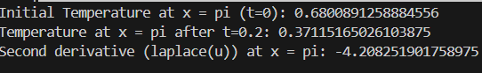
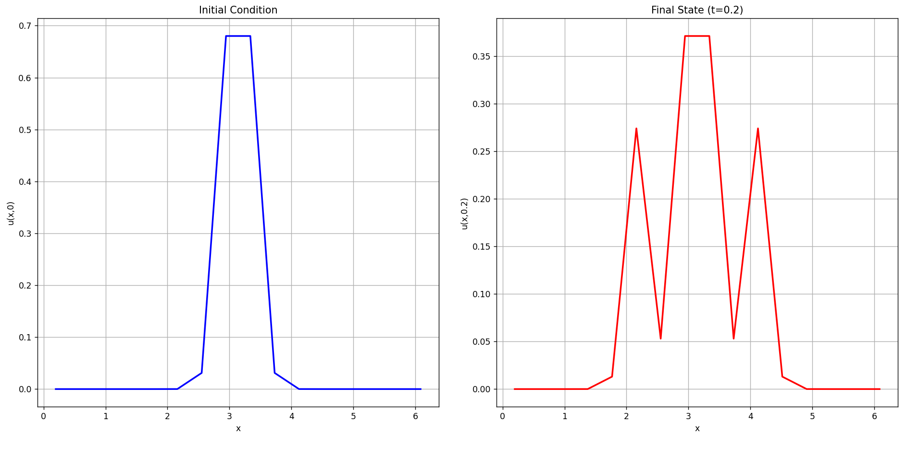
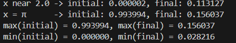
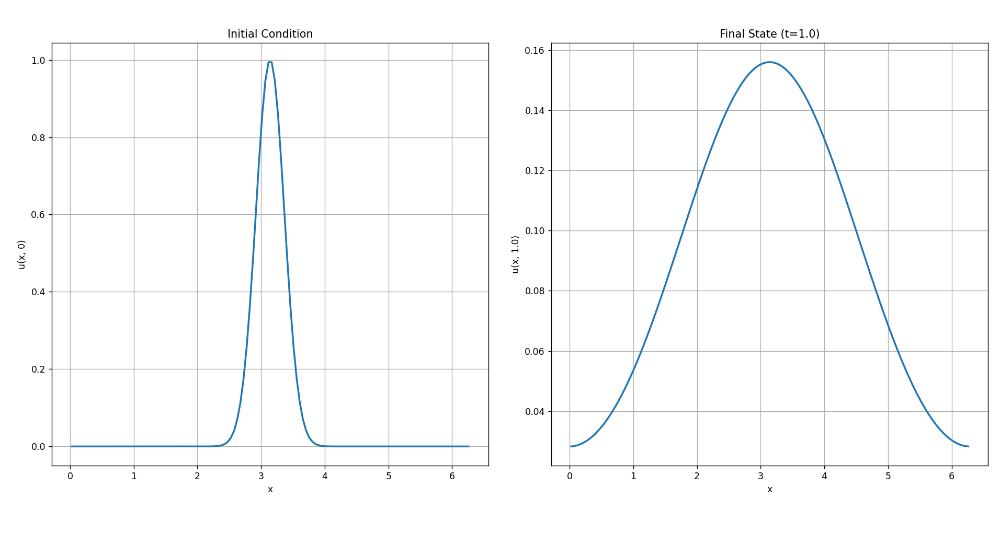

# Heat Equation Solver (py-pde)

A 1D heat equation solver (`u_t = ∇²u`) built with the [`py-pde`](https://py-pde.readthedocs.io/) library, starting from a Gaussian temperature pulse on `[0, 2π]`.

## The bug: unstable time-stepping

My first version picked a fixed time step (`dt = 0.02`) without checking it against the grid spacing. For an explicit diffusion scheme, the time step has to satisfy a CFL-style stability condition (`dt ≲ 0.5·dx²`) or the numerical solution overshoots and oscillates — which is exactly what happened:




The final state at `t=0.2` should look like a smoothed-out version of the initial pulse, but instead the "cold" regions on either side of the peak show numerical noise, and the profile itself has picked up spurious ripples — physically, heat should only ever spread out and smooth over, never oscillate.

## The fix: CFL-constrained time stepping

Recomputing `dt` from the grid spacing (`dt = min(0.01, 0.5 · dx²)`) instead of using a fixed value fixes it:

```python
dx = float(x[1] - x[0])
dt_cfl = 0.5 * dx * dx
dt = min(0.01, dt_cfl)
```

With a properly bounded time step, the solution behaves physically — the peak decreases monotonically and the profile smooths into a clean diffusion curve, with no oscillation:




## Tech
- **Language:** Python
- **Library:** [`py-pde`](https://py-pde.readthedocs.io/), NumPy, Matplotlib
- **Method:** finite-difference PDE solving with CFL-constrained explicit time-stepping
